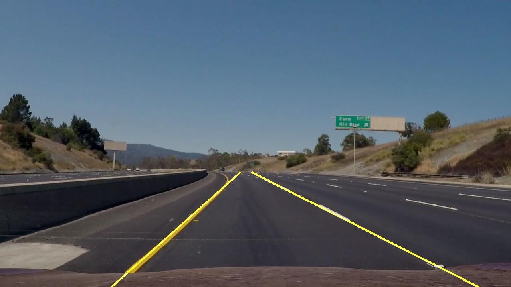
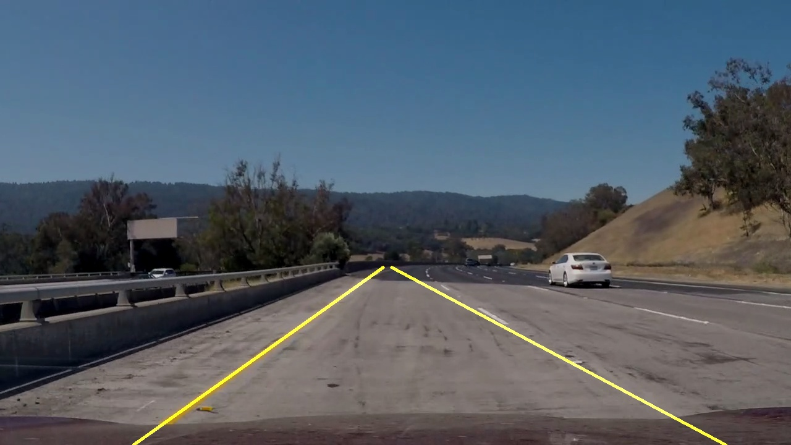

### Test8 

cv2_7_Detection 코드를 troubleshooting.py에서 하나씩 분석해 가면서 오류를 찾아나갔다.

```python
x = NX.asarray(x) + 0.0
if x.size == 0:
    raise TypeError("expected non-empty vector for x")
```

최종적으로 에러를 찾았는데 가장 중요한 부분은 NX.asarray에 관한 것 이었다.

```python
import numpy.core.numeric as NX
```

numpy에서 수와 관련된 하위 모듈이다.

```python
if (NX.asarray(array_left_line)+0.0).size != 0 and (NX.asarray(array_right_line)+0.0).size != 0:
            line_image = draw_lines(
            frame,
            [[
                array_left_line,
                array_right_line,
            ]],
            (0,255,255),
            3,
            )
    print("OK")
else:
    print("NOn")
    pass
```

에러를 찾는데 NX.asarray를 이용하여 array값의 크기가 0이 아닐 때에만 라인을 그리면 어떨까? 생각하여 프로그래밍 했다. 하지만 에러는 잘 해결되지 않았고, 다른방벙을 찾아야 했다.

```python
if left_line_x is not None and left_line_y is not None:
   try:
        poly_left = np.poly1d(np.polyfit(
        left_line_y,
        left_line_x,
        deg=1
        ))
   except:
        pass
   left_x_start = int(poly_left(max_y))
   left_x_end = int(poly_left(min_y))
if left_line_x is None or left_line_y is None:
   pass
        
if right_line_x is not None and right_line_y is not None:
   try:
        poly_right = np.poly1d(np.polyfit(
        right_line_y,
        right_line_x,
        deg=1
        ))  
        print("Ok+deg")
   except:
        print("NO+deg")
        right_x_start = int(poly_right(max_y))
        right_x_end = int(poly_right(min_y))
if right_line_x is None or right_line_y is None:
   pass
        
array_left_line = [int(left_x_start), int(max_y), int(left_x_end), min_y]
array_right_line =[int(right_x_start), int(max_y), int(right_x_end), min_y]
```

여러가지 방법을 생각해 보다가 마지막에 생각해낸 방법이다. 에러가 발생하고, 에러의 원인을 찾기 어렵다면, 에러의 원인을 찾기보다 예외처리를 구상하고자 하여 만들었다. 라인을 그리는 함수를 실행할 때 에러가 발생하면 라인 그리는 함수를 실행하지 않는 다는 것이다.

```python
if left_line_x is not None and left_line_y is not None:
   try:
        poly_left = np.poly1d(np.polyfit(
        left_line_y,
        left_line_x,
        deg=1
        ))
        prev_poly_left = poly_left
   except:
        poly_left = prev_poly_left
   left_x_start = int(poly_left(max_y))
   left_x_end = int(poly_left(min_y))
if left_line_x is None or left_line_y is None:
   pass
        
if right_line_x is not None and right_line_y is not None:
   try:
        poly_right = np.poly1d(np.polyfit(
        right_line_y,
        right_line_x,
        deg=1
        ))  
        print("Ok+deg")
        prev_poly_right = poly_right
   except:
        print("NO+deg")
        poly_right = prev_poly_right
        right_x_start = int(poly_right(max_y))
        right_x_end = int(poly_right(min_y))
if right_line_x is None or right_line_y is None:
   pass
        
array_left_line = [int(left_x_start), int(max_y), int(left_x_end), min_y]
array_right_line =[int(right_x_start), int(max_y), int(right_x_end), min_y]
```

try예외 처리방법을 처음 고안해서 에러를 없앴을 때 보다 더 개선한 방법이다. try예외처리 방법을 사용하면 에러가 뜨는 경우 값을 건너뛰게 되고, 건너뛰게 되면 그 부분의 값이 사라져  프로그램이 부정확해진다. 값이 일정하게 뜨지 않고 에러가 뜨지 않는 경우에만 뜨기 떄문이다. 그래서 에러가 뜨지 않을 경우 prev_ 변수를 지정하고, 에러가 발생한 경우 prev_값을 넣어 주는 방식으로 구현했다.

#### 프로그램 동작





#### 다음 작업

모듈화 구현

