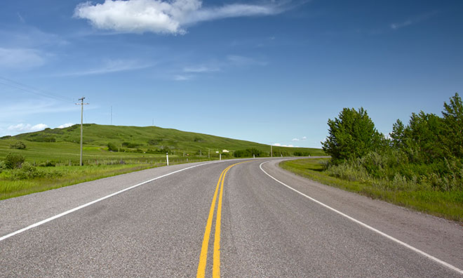
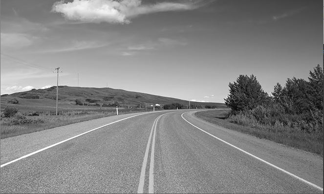
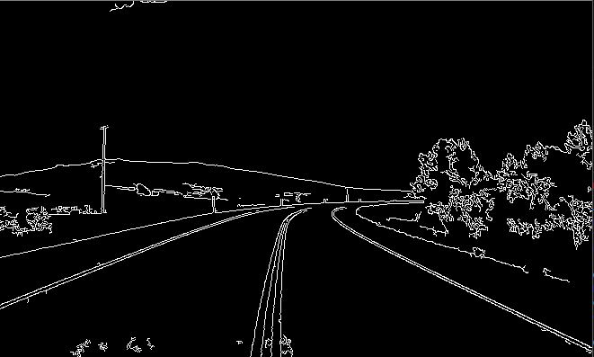
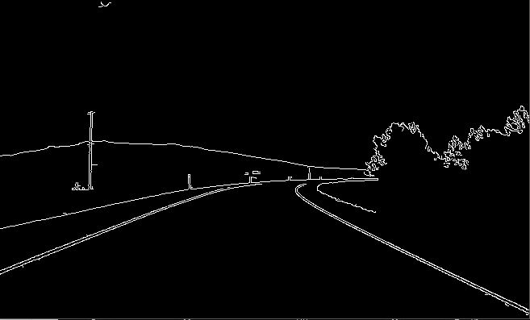

### Test1

도로의 차선을 찾기 위해 Canny Edge Algorithm을 이용하기로 했다.  Canny Edge Algorithm은 이미지의 윤곽을 찾아내는 알고리즘이다.

낮은 에러율을 가지고 있고, 이미지속의 점들을 연결하여 가장자리를 찾아준다.

#### Canny Edge Algorithm

+ 1. Smoothing

  이미지의 픽셀에서 경계 (꺾이는 점)을 찾기 위해 미분을 하면 불규칙한 노이즈가 발생하고, 불규칙한 노이즈를 해결하기 위해 가우시안 필터를 이용한다. 

  가우시안 필터는 일정 값을 기준으로 다른 픽셀의 값을 가깝게 하여 이미지에 Blur를 주어 전체적으로 노이즈를 낮추는 알고리즘이라고 생각하면 된다.

  저대역 부분은 강하게, 고대역 부분은 약하게 하는 필터이다

   

+ 2. finding gradients

  미분값을 통해 가장자리를 찾는 것이다. 미분한 그래프에서 극 값을 값는 x를 찾으면 Edge가 된다. x, y 축을 각각 미분하는 SobelMask를 이용하고, 미분을 하여 나온 값을 나열하면 각각 영상이 얻어진다.  각각의 x,y를 이용해 피타고라스 정리로 경사를 구하고, 삼각함수로 각도를 구한다음 각도에 따라 5개의 구역으로 구분한다.

  

  

  이 방식으로 구한 Edge를 나타내면 

  

  이 그림과 같이 Edge로 분류된 구역이 상대적으로 밝아지게 되어 윤곽선이 나타나게끔 된다.

+ 3. Non-maximum suppression

  극값을 선정할때 잘못된 Edge를 제가하는 작업으로 현재 픽셀의 Edge에서 양 방향과 음 방향의 강도에 따라 Edge를 비교 판단하여 가장 강도가 큰 Edge 만 남겨둔다.

  

+ 4. Double thresholding

  임계값 두개를 정하여 하나의 임계값 아래는 없에고, 다른 하나의 임계값 보다 높으면 나타낸다.

+ 5. Edge tracking by hysteresis

  강한 에지와 약한 에지 사이의 연관성을 분석한다. 강한 에지와 근처의 약한 에지는 보존되고, 약한 에지는 제거한다.

#### 코드 구현

기본 이미지

***

cv2.COLOR_BGR2GRAY

***

cv2.Canny(img,100,420)

***

cv2.Canny(img,150,620) 

임계값을 620보다 높게 잡으면 나무와 도로가 같이 사라진다.

***

#### 다음 목표

+ Contour를 이용하여 라인을 마킹한다
+ 혹은 Convex Hull을 이용해 큰 틀을 잡을 예정

#### 고려사항

+ 미적을 사용하는 Canny Edge가 영상에서 재생될 지 의문이다. 