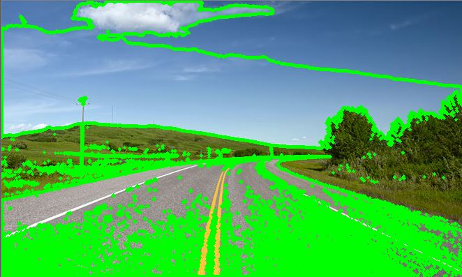
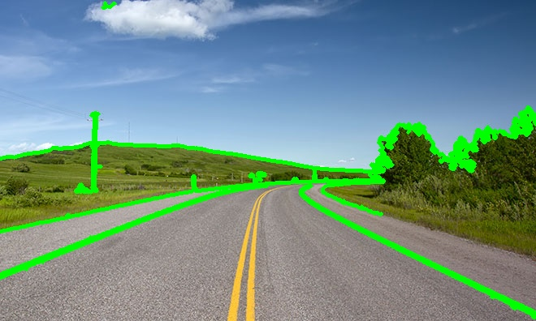

### Test2

Contour를 이용해 도로를 찾아보려 했다.


threshold와 저번에 했던 Canny edge를 이용해 선처리를 최대한 정확하게 하려 했다.

#### Code

```python
ret, thresh = cv2.threshold(edges, 127, 255, 0)
```

threshold(한계점)을 이용하여 이미지 변환

```python
contours,hierachy =
cv2.findContours(thresh,cv2.RETR_TREE,cv2.CHAIN_APPROX_SIMPLE)
```

```RETR_TREE``` 모든 컨투어 라인을 찾고 hierarcy 관계 구성

```CHAIN_APPROX_SIMPLE```찾는 점의 계수를 최소화



Canny Edge Algorithm 적용 전 findContours

***




Canny Edge Algorithm 적용 후 findContours

***

#### Contour 결론

Contour를 사용하면 경계를 찾는  것이기 때문에 도로 뿐만 아닌 주변의 산과 같은 불필요 요소도 검출된다. 이를 해결하기 위해서는 사잔을 잘라 아래 부분만 사용하거나, Convex Hull을 이용해 보려고 시도해 봐야 할 것 같다.

