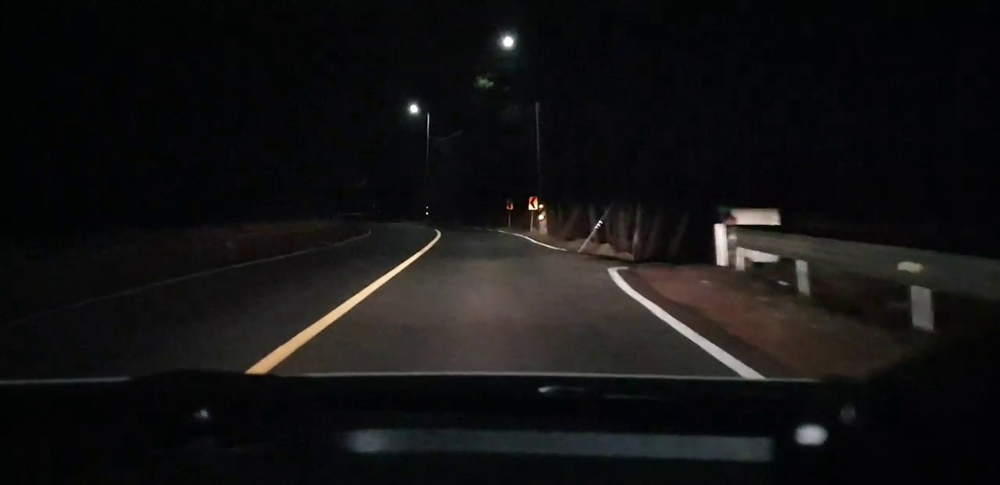
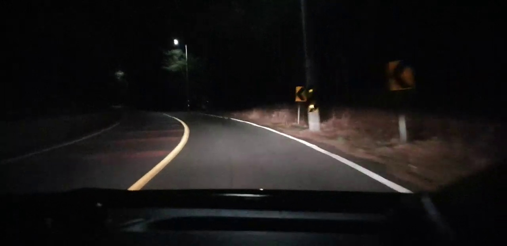
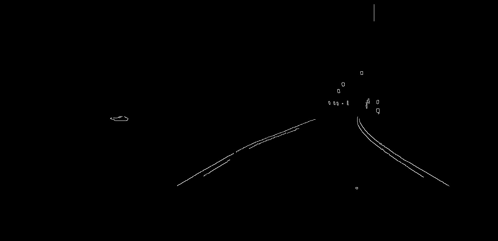
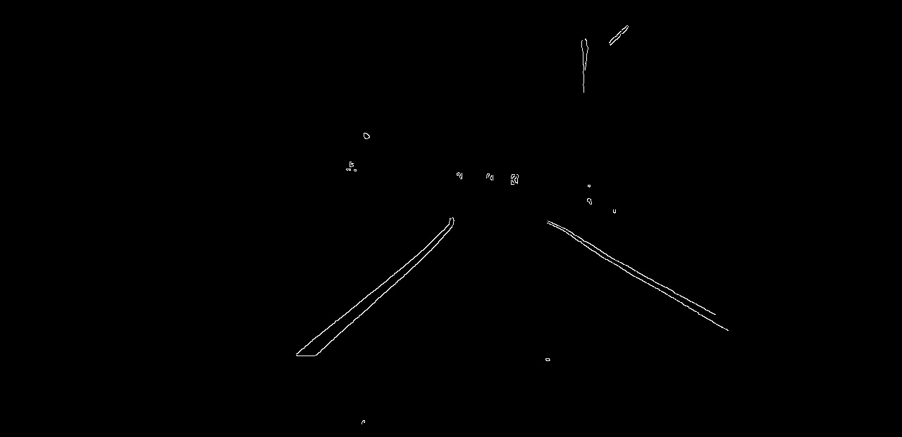
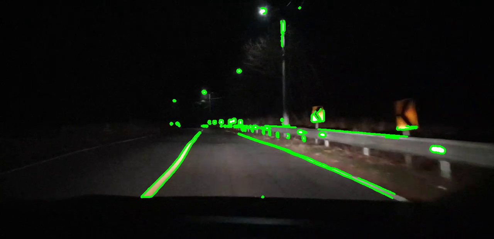
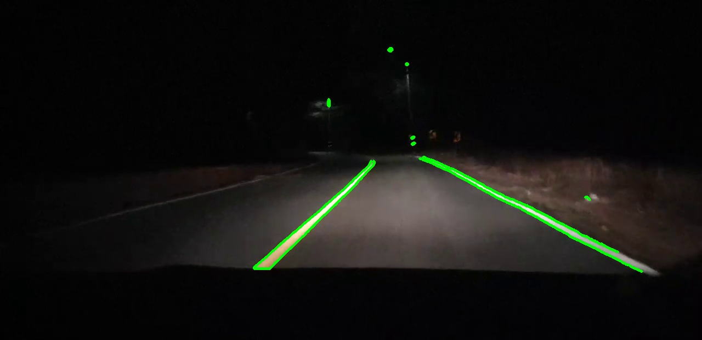

### Test3

Contour를 사용하여 얻게된 결과를 영상프레임에 담아본다.

Test2에서 사용한 코드를 이용해 영상에 올릴것인데 Canny edge가 미적 공식을 사용하여 많은 계산을 필요로 하고, Contour 또한 많은 수학 계산 (Numpy)등을 이용해서 하기 때문에 제대로, 속도 저하 없이 될 수 있을지 의문이다.

src의 cv2_2.py의 Contour 코드를 다시 사용하여 이미지 프레임을 하나씩 표시하는 비디오 방식으로 movie.read를 통해 재생해본다.

```python
movie = cv2.VideoCapture(FilePath)
```

비디오 캡쳐 함수로 영상 프레임을 Movie로 불러온다.

```python
ret, frame = movie.read()

grayframe = cv2.cvtColor(frame, cv2.COLOR_BGR2GRAY)
edges = cv2.Canny(grayframe,250,420)
```

ret, frame으로 읽어오고, gray로 색을 입힌다음 edges에 Canny edge algorithm을 넣는다.

그리고 edges를whille문의 imshow를 사용하여 불러온다.





비디오로 읽어온 샘플 영상

***






Canny edge scanner를 이용한 검출

***






CannyEdge Algorithm, Contour를 이용하여 검출한 도로 차선의 모습. 

***

비디오에서 속도 저하가 예상되었지만, 오히려 빠른 속도로 동작하여 속도 측에서는 문제가 없다. 하지만, CannyEdgeAlgorithm과 Contour를 사용해 검출을 하여 모서리, edge부분을 찾기 때문에 정확히 도로만 찾아내기 어렵다는 한계점이 있다.

***

#### 생각하는 개선 방안

matplotlib를 이용하여 차선이 들어가는 좌표를 구하고, 그 외의 좌표계의 Contour에는 다른 색을 지정하여 도로와 표지판, 가로들을 분류할 예정