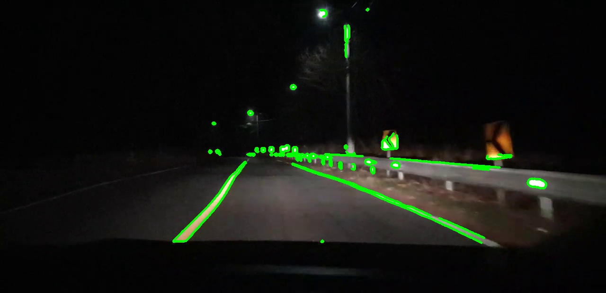

### Test4

비디오의 컨투어 좌표를 비교 연산하여 영역을 구하기 위해 마우스 클릭으로 이미지의 x축, y 축의 좌표를 구해내는 코드를 작성한다.

#### Code

기존의 cv2_2.py 코드에서 조금 추가하여 코드를 구성한다

```python
def CallBackFunction(event,x,y,flag,params):
    if(event == cv2.EVENT_LBUTTONDOWN):
        print("x 좌표: ",x, "y 좌표", y)
```

```python
cv2.setMouseCallback('image',CallBackFunction)
```

마우스 콜백 이벤트에 대한 기능을 할 CallBackFunction을 만든다.

마으스 콜백 이벤트에 대한 함수 CallBackFunction은 image 이름에 개체에서 마우스 왼쪽 클릭 이벤트가 생기면 실행된다.


x, y좌표의 값을 이미지에서 읽어 오는 것을 확인하였다. cv2_4_Mouse.py 주석

***

#### 영상에서 x,y 좌표값 읽어오기

작성한 마우스 콜백 함수를 cv2_3.py 코드에 접목하여 새로 만든다.


예상대로 영상에서도 콜백함수가 무리없이 동작한다.

***

#### 다음 작업



현재 Contour Algorithm으로 Contour를 찾은 부분은 도로 뿐만 아니라 주변 오브젝트도 나타난다. 

이 때문에 tensorflow를 이용하여 이미지를 분석하여 도로 요소만 추출하는 방법으로 새롭게 구성하려고 했는데, 현재의 상태에서 영역 별로 구분해 다른 색으로 Contour를 나타낼 수 있으면 훨씬 빠른 속도로 도로, 다른 오브젝트를 찾을 수 있지 않을 까 하여 Contour 분리 작업을 해보기로 했다.