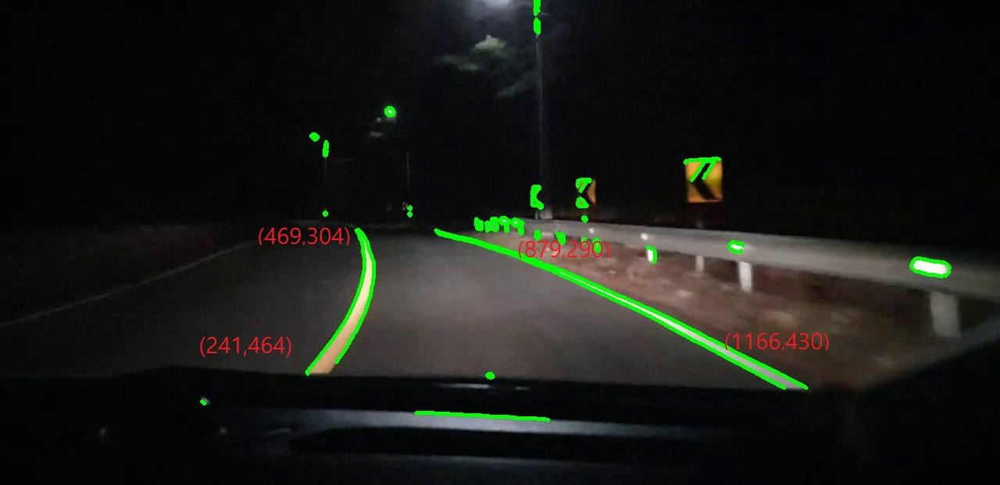
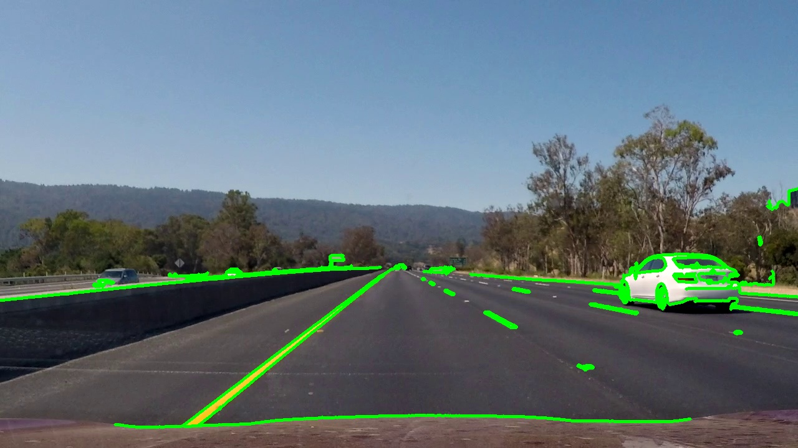
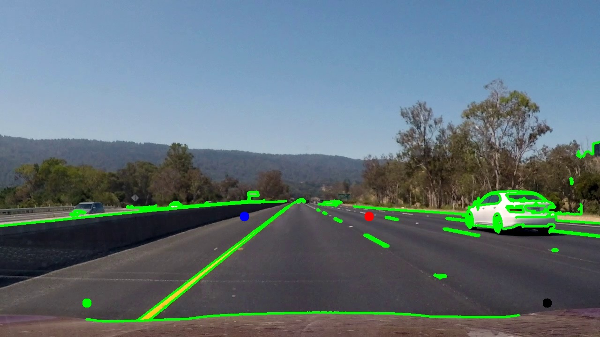
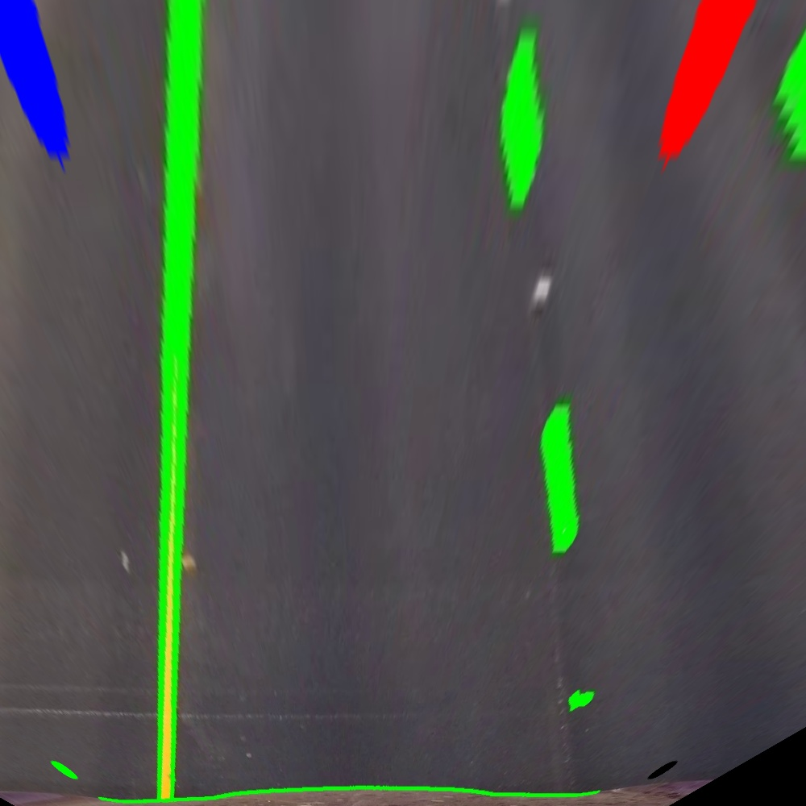
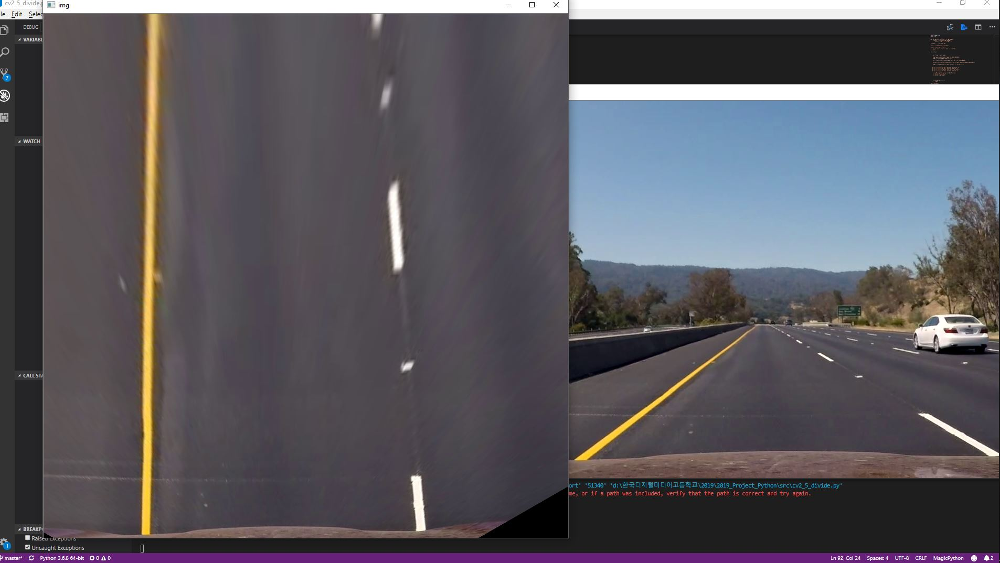
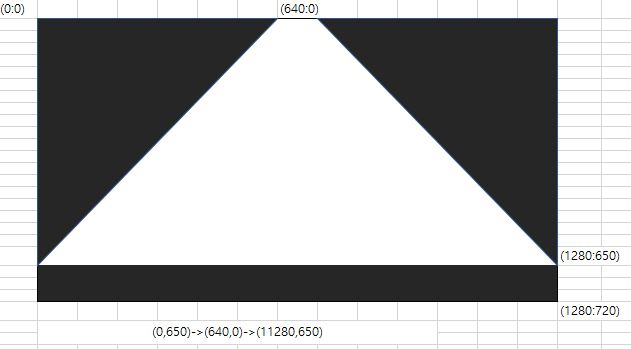
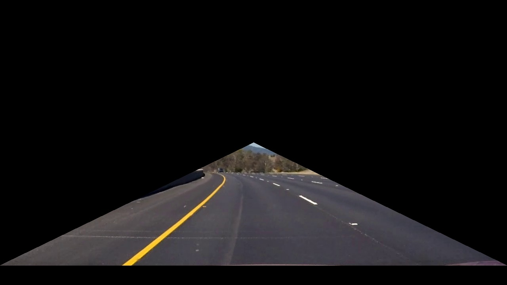
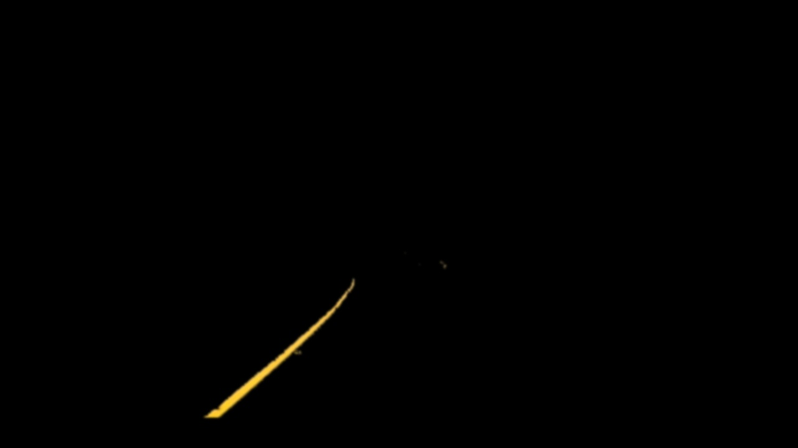
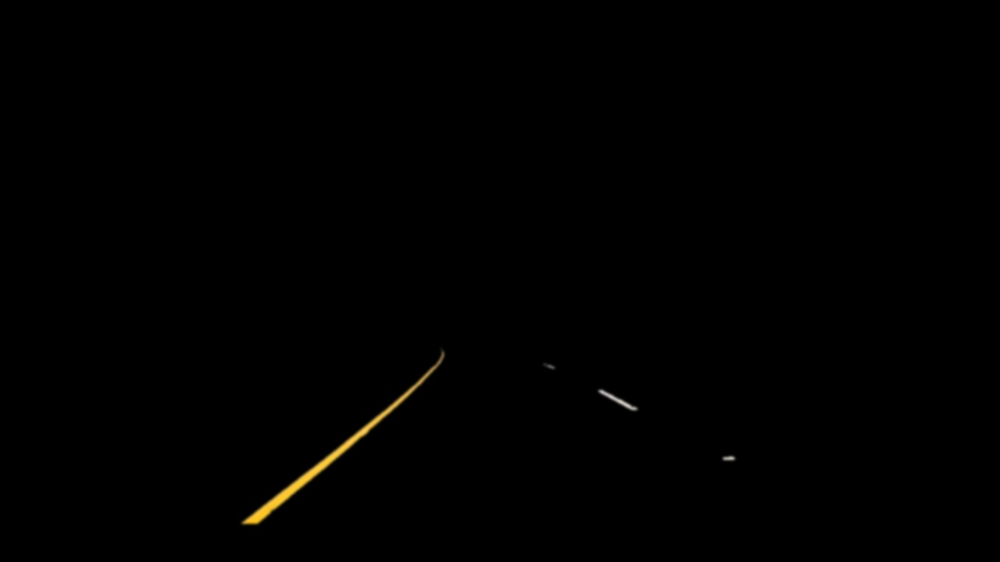
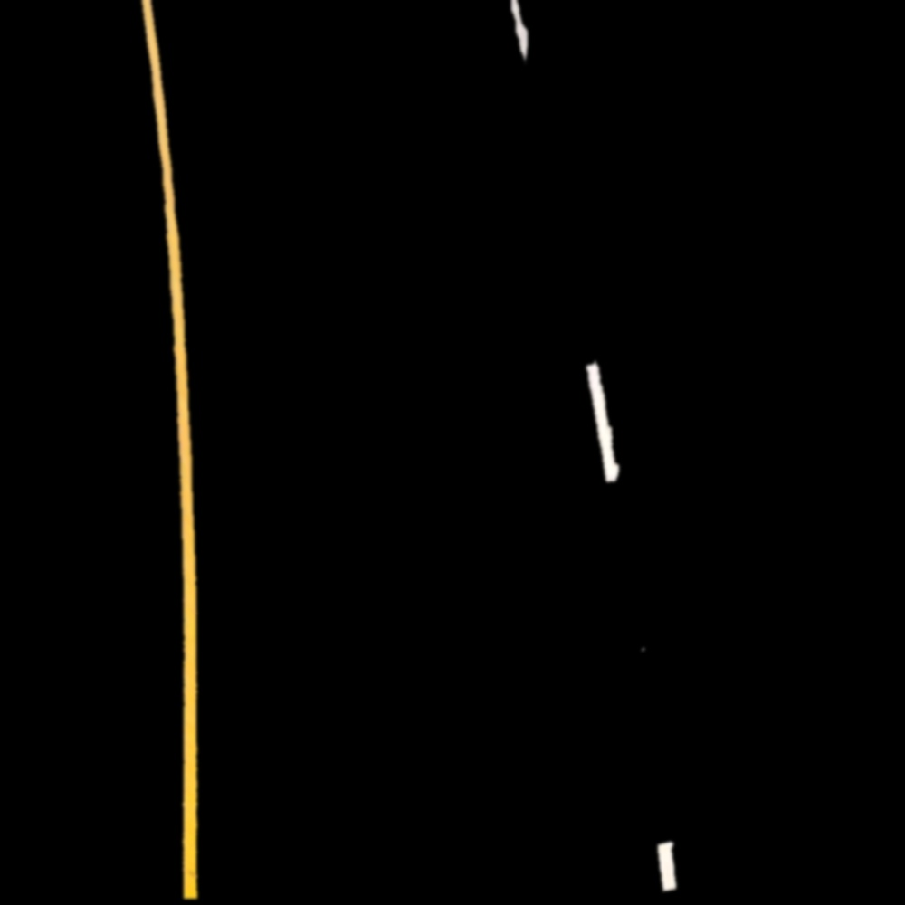

### Test5

cv2_5_divide.py

마우스 콜백함수를 이용해서 좌표를 구해오는 방법으로 영역을 구분해서 영역별로 나누어 도로를 찾아내려 했지만, 영상속에서 위치가 계속 변하기 때문에 의미 없다는 것을 알게 되었다.



콜백함수로 구한 좌표를 이용해서 영역을 구분해보았는데 의미가 없었다.

블랙박스 영상에서 아래 부분에 가려지는 부분이 있어 영상을 바꿀 필요도 있다고 생각된다. 현재까지 사용한 영상은 어두울 때의 영상인데, 비디오 이미지 자체를 흑백으로 하여 canny edge 분석을 하기 때문에 어둡거나 밝을 대 상관 없을 것이라고 생각되지만, 

혹시 다를 수도 있기 때문에 밝고, 화면 아래 가리는 부분이 더 적은 영상으로 바꾸어서 테스트 해 보려고 한다.

***

#### 결론

영역을 구분해서 도로 차선을 검출하는 방법은 의미가 없다.

비디오 이미지 전체에서 영역을 구분하는 것이 아닌, 비디오의 특정 영역에서만 요소를 검출하는 것이 도로 차선을 찾는데 더 효과적이고, 정확할 것 이라고 생각한다.



밝은 영상일 때의 모습. 

모든 영역의 경계를 찾기 때문에 이와 같은 방식으로 도로 요소를 검출하려 하면 안된다.

***

#### 아이디어 2 : 이미지 왜곡

4x2 numpy 행렬에 x,y좌표를 저장한다

그 다음 getPetspectiveTransform으로 이미지를 변형하고 warpPerspective를 이용하여 변형된 이미지를 이동해 나타낸다



이미지 변형 전의 상태 (기존과 동일)

파랑, 빨강, 초록, 검정색 점으로 변형할 위치 표시

***



변형 후 이미지 상태 

도로 부분을 위에서 수직으로 바라보았을 때의 느낌을 주는 상태

***

#### 영상에서 이미지 변형



비디오에서 영상 재생

***

#### 아이디어 재구성

기존에 사용하려 했던 Contour만을 이용한 방법이 실패로 끝나 새로운 방법을 구성해 보기로 했다.

+  이미지의 기하학적 변형 (Perspective)를 이용하기
  + 이미지 특정 좌표만 확대하여 수직으로 그려다보는 상태 구성
  + 위쪽에서 구성한 프로그램 (아이디어2)
  + 도로를 수직으로 내려다 볼 때의 Perspective를 준다
+ Mask를 이용해 처음부터의 검출 영역을 지정하기
  + Mask에서 도로 검출에 필요한 구역만 남기고 나머지 구역을 블라인드 처리

***

#### 아이디어 3

아이디어를 재구성 한 것을 토대로 두가지 아이디어를 동시에 진행하기로 하였다.

3번째 아이디어 Mask 검출

도로에 특정부분만 제외하고 나머지 부분을 블라인드 처리한다



이러한 형태로 검정색 영역을 Mask 처리 할 예정

***

cv_5_divide.py

```python
def location_vertices_mask(img,vertices):
    mask = np.zeros_like(img)
    cha = img.shape[2]
    mask_color = (255,) * cha   
    
    cv2.fillPoly(mask,vertices,mask_color)
    mask_img = cv2.bitwise_and(img,mask)
    return mask_img


def give_cropimg(img):
    frame_y = frame.shape[0]
    frame_x = frame.shape[1]
    location_vertices = [(0, frame_y-50),(frame_x / 2, frame_y / 2 ),(frame_x, frame_y-50),]
    return location_vertices_mask(frame,np.array([location_vertices],np.int32))

```

Mask 영역 검출할 때 사용할 함수 두가지

`location_vertices_mask`는 `give_croping`에서 호출된다 Video img와 mask를 `cv2.bitwise_and()`를 이용하여 결합시킨다.



Mask bitwise를 이용해 Mask와 Video를 결합시킨 모습

#### HSV COLOR detection

Contour를 이용하여 도로 라인을 찾기에는 다른 요소들 또한 많이 찾기 때문에 문제가 있었다. 그래서 HSV의 특정 색상, 명도, 채도의 값을 가지는 요소만 추출할 수 있도록 HSV detection 기능을 추가한다. 

추가로, 추출한 이미지에서 `Gaussian Blur`를 이용해 보정을 한다.

```python
lower_yellow =  np.array([20,100,100])
upper_yellow =  np.array([30,255,255])

mask_yellow = cv2.inRange(hsv,lower_yellow,upper_yellow)
img_yellow = cv2.bitwise_and(hsv, hsv, mask = mask_yellow)
img_yellow = cv2.cvtColor(img_yellow, cv2.COLOR_HSV2BGR)
img_yellow_blur = cv2.GaussianBlur(img_yellow,(9,9),0)
```

이러한 방식으로 기본적인 색상만 추출 가능하도록 코딩



노란색 요소 추출

***



흰색 요소 추출

흰색 요소만 추출하는 것을 목표로 했지만, 흰색 특성상 채도, 명도, 각도를 분류할 때 노란색이랑 겹치는 부분이 생기게 된다는 걸 알게되었고, 원하는 부분만 뽑을 수 있는 결과가 나와서 이대로 사용하기로 했다.

***



perspective_see 이미지에서 분류한 색상

***

#### 다음 진행 사항

추출한 색상을 바탕으로 계산을 통해 중심점으로부터 도로의 위치를 구할 예정이다.