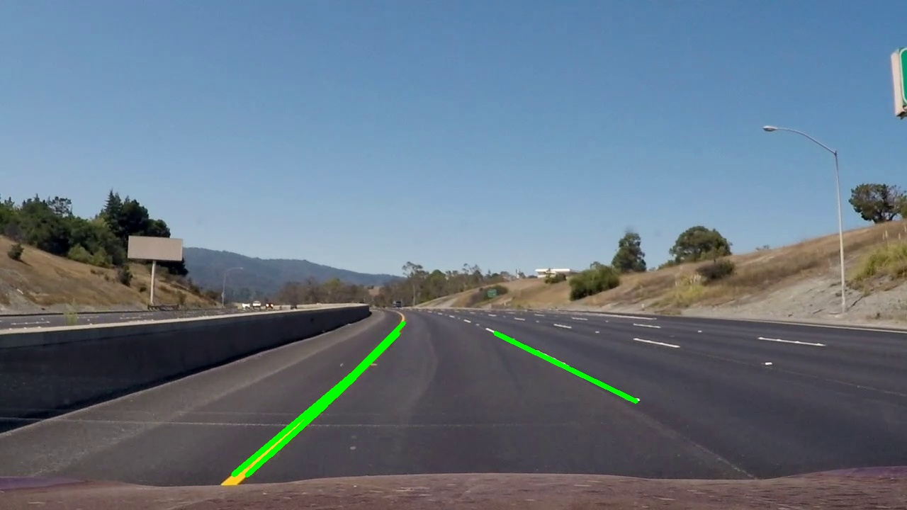
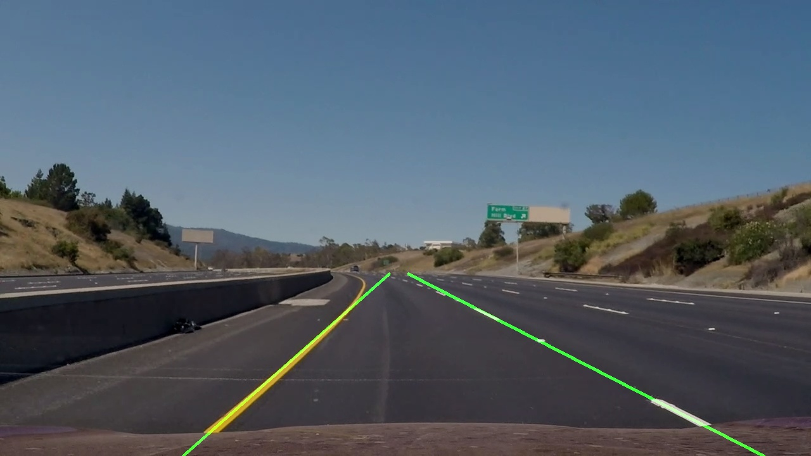

### Test7

cv2_7_Detection.py



HoughLinesp -> frame

***

위 이미지에서 HoughLinesp가 여러 선을 한꺼번에 찾는 문제가 있어 정확한 값을 추출하기 어렵다. 그래서 최소좌표, 최대좌표만을 표시해 연결하는 프로그램을 만든다.

```python
left_line_x = []
left_line_y = []
right_line_x = []
right_line_y = []
```

각 라인에 맞추어 좌표값을 저장할 변수이다.

```python
for line in lines:
    for x1, y1, x2, y2 in line:
        slope = (y2 - y1) / (x2 - x1) 
        if math.fabs(slope) < 0.5:
            continue
        if slope <= 0:
            left_line_x.extend([x1, x2])
            left_line_y.extend([y1, y2])
        else:
            right_line_x.extend([x1, x2])
            right_line_y.extend([y1, y2])
```

다음으로 cv2.HoughLinesP에서 구한 lines에서 경사에 따라 분류한다. 어느 정도 이상의 기울기를 갖는 점을 찾고, 그 점 두개 사이의 기울기에 따라 왼쪽, 오른쪽을 분류한다.

```python
min_y = frame.shape[0] * (3 / 5)
max_y = frame.shape[0] 
```

y값의 범위를 정한다. ( 0 <= y <= frame * 3/5 )

`poly1d`,`polyfit`을 사용하여 정확한 좌표를 찾는다.

```python
poly_left = np.poly1d(np.polyfit(
    left_line_y,
    left_line_x,
    deg=1
))
```

poly_left 라는 변수에 1차원 함수(polyfit(deg=1))로 맞춰 구한 값을 poly1d형태의 클래스로 저장한다. 

```python
left_x_start = int(poly_left(max_y))
left_x_end = int(poly_left(min_y))
```

대입해서 구한다.

오른쪽도 이와 똑같이 한다.

```python
line_image = draw_lines(
    frame,
    [[
        [int(left_x_start), int(max_y), int(left_x_end), min_y],
        [int(right_x_start), int(max_y), int(right_x_end), min_y],
    ]],
    (0,255,0),
    3,
   )
```

라인을 그린다.

문제점 1. left_x_start, max_y, left_x_end 등의 모든 변수는 프로그램상으로 앞에 int를 붙이지 않아도 정수형 변수이어야 하는데 실수형 값이 들어가 int를 붙이지 않으면 에러가 뜬다.

문제점 2.



분명 찾은 값에 따라 라인 정리는 잘 되지만, 

```
Traceback (most recent call last):
  File "cv2_7_Detection.py", line 152, in <module>
    deg=1
  File "C:\Users\user\AppData\Local\Programs\Python\Python36\lib\site-packages\numpy\lib\polynomial.py", line 598, in polyfit
    raise TypeError("expected non-empty vector for x")
TypeError: expected non-empty vector for x
```

이와같은 에러가 뜬다.

해결방법을 계속 찾고 있는데 찾기가 너무 힘들다.

```
x = NX.asarray(x) + 0.0
if x.size == 0:
    raise TypeError("expected non-empty vector for x")
```

에러의 조건


